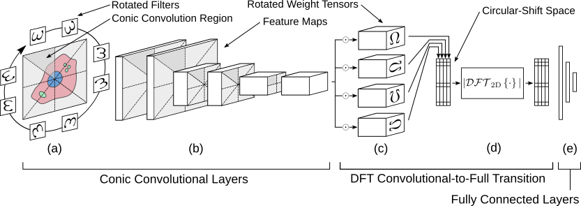

# RiCNN

**R**otation **i**nvariant CNN (RiCNN) is type of neural network that accomplishes rotation equivariant convolution and global rotation invariance. Rotation equivariances is accomplished by a novel convolution scheme in which, rather than convolving filters in a raster fashion, rotated filters are convolved over corresponding conic regions of the input feature map. Global rotation invariance is accomplished by transforming the output of the final convolutional layer to a circular-shift space and applying the 2D-DFT.



## Installation

Required Python packages: TensorFlow, Numpy

From within the main folder, run the following from the command line:
```
python setup.py install
```

## Usage

There are three primary functions for constructing an instance of RiCNN: 'rotation_equivariant_conv2d()', 'conv_to_circular_shift()' and 'dft2d_transition()'.

The first implements the conic convolution and essentially replaces the function 'tensorflow.nn.conv2d()' from TensorFlow. It takes in a feature map, weights, and some parameter information, performs rotation-equivariant convolution, and outputs the resulting feature map.

The second takes in the final convolutional feature map of the network and applies fully-connected, rotated weight matrices, transforming rotation in the input feature map to circular shift in the output.

The final applies the magnitude of the 2D-DFT to the output of the previous, effectively enforcing global rotational invariance for the network.

The above functions require knowledge about the dimensions of each feature map, which are calculated by helper functions: 'calculate_reconv_output_size()' and 'calculate_dft_output_size()'. These should be called for each corresponding layer in the network and their output should be passed along to the next.

For a basic example of an instance of RiCNN, see 'example.py'.

### Recommendations

A good strategy for constructing RiCNN is using a higher number of rotations for convolutional layers occuring earlier in the network and then tapering to a smaller number, most likely 4, for the input to the DFT transition layer.

## Notes

There are a few limitations with the current implementation or RiCNN:
* Rotation invariance is only guaranteed for multiples of 90 degrees, but is approximated for 45 degrees.
* Only rotations of 8 (45 degrees) or 4 (90 degrees) are currently implemented, though the method can be extened to finer rotations, so long as they are a power of 2.
* Curently, only VALID padding is implemented for convolution. SAME padding will be coming soon.

## References

B. Chidester, M. N. Do, J. Ma, *Rotation Equivariance and Invariance in Convolutional Neural Networks*, arXiv preprint (https://arxiv.org/abs/1805.12301)
